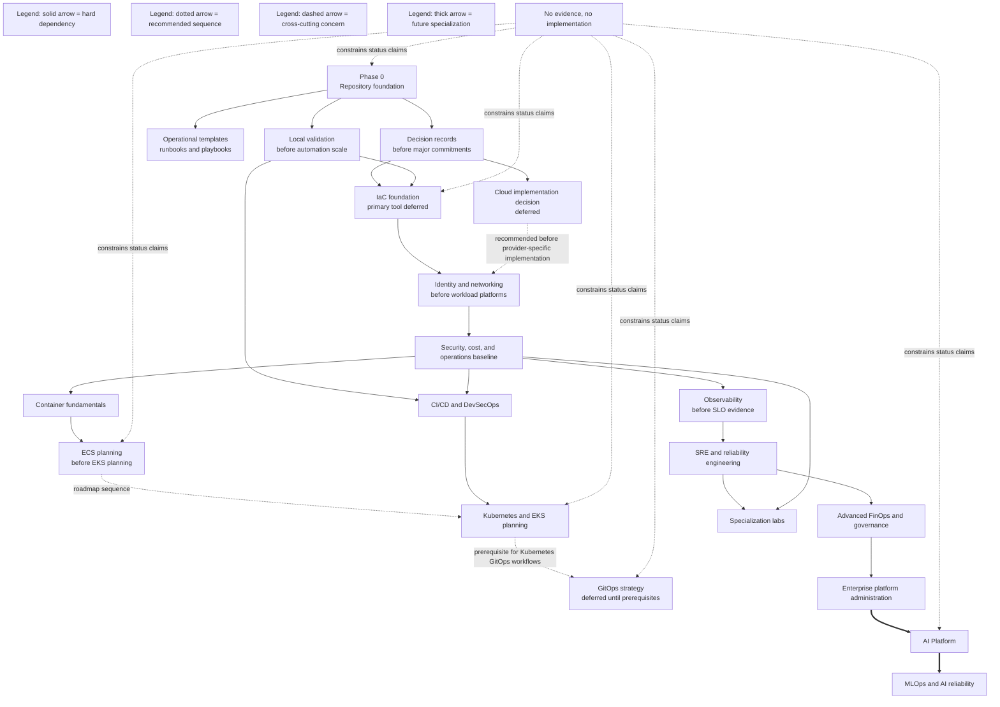

# Capability Dependency Map

## Status

Representation type: **Planned capability relationship**.

Status: **Planned**.

This diagram uses dependency and sequencing rules from the roadmap, blueprint, architecture, and accepted ADRs. It does not claim that any capability is implemented.

## Purpose

This diagram answers: what documented dependencies and sequencing constraints should guide future ECPEL platform work?

## Scope

Included:

- documented phase sequencing;
- dependency rules from the roadmap;
- selected conceptual dependencies from the blueprint;
- accepted ADR decisions and deferrals that affect sequencing.

Excluded:

- unapproved provider topology;
- cloud account/resource dependencies;
- runtime implementation details;
- assumptions that are not supported by repository documentation.

## Source Documents

- [ROADMAP.md](../../ROADMAP.md)
- [BLUEPRINT.md](../../BLUEPRINT.md)
- [ARCHITECTURE.md](../../ARCHITECTURE.md)
- [ADR-0001: Record Architecture Decisions](../adr/0001-record-architecture-decisions.md)
- [ADR-0002: Defer Primary Implementation Cloud Decision](../adr/0002-defer-primary-implementation-cloud-decision.md)
- [ADR-0003: Defer GitOps Strategy Decision](../adr/0003-defer-gitops-strategy-decision.md)
- [ADR-0004: Adopt Evidence-Driven Implementation Rule](../adr/0004-adopt-evidence-driven-implementation-rule.md)
- [ADR-0005: Sequence ECS Before EKS in Roadmap Planning](../adr/0005-sequence-ecs-before-eks-in-roadmap-planning.md)
- [ADR-0006: Defer Primary Infrastructure as Code Tool Decision](../adr/0006-defer-primary-infrastructure-as-code-tool-decision.md)

## Diagram

## Interpretation

Solid arrows represent hard dependencies from the roadmap and governance model, such as foundation before validation and decision records before major commitments. Dotted arrows represent recommended sequencing, such as ECS planning before EKS planning. Dashed relationships represent cross-cutting constraints, especially the evidence rule. Thick arrows represent future specialization, such as AI Platform leading into MLOps.

The cloud provider, GitOps strategy, and primary IaC tool decisions are shown as deferred because accepted ADRs intentionally defer those implementation choices.

## Limitations

> This diagram represents documented intent or conceptual relationships. It is not evidence of deployed infrastructure.

The diagram does not prove that Terraform, AWS, ECS, EKS, CI/CD, GitOps, SRE, AI, MLOps, or any other platform capability is implemented. It does not define cloud resources or runtime topology.

## Related Documents

- [Platform Domain Map](platform-domain-map.md)
- [Evidence and Status Lifecycle](evidence-and-status-lifecycle.md)
- [ADR index](../adr/README.md)
