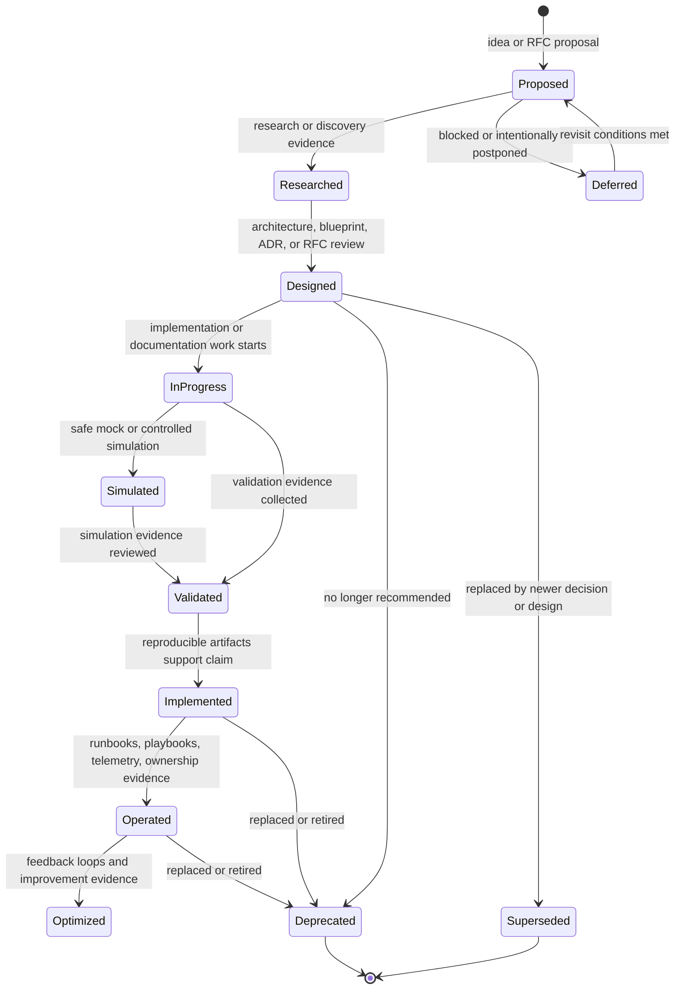

# Evidence and Status Lifecycle

## Status

Representation type: **Process or lifecycle**.

Status: **Designed**.

This diagram reconciles status terminology from the README, roadmap, blueprint, ADRs, and operational templates. It does not create a competing status model.

## Purpose

This diagram answers: how does ECPEL work progress from an idea to an evidence-backed capability, and where do review, simulation, implementation, operation, deprecation, and deferral fit?

## Scope

Included:

- established repository status concepts;
- evidence requirements for implementation claims;
- simulation labeling expectations;
- operational maturity expectations;
- deprecated or superseded paths.

Excluded:

- real validation results;
- real implementation evidence;
- production readiness claims;
- automated workflow results that do not exist.

## Source Documents

- [README.md](../../README.md)
- [ROADMAP.md](../../ROADMAP.md)
- [BLUEPRINT.md](../../BLUEPRINT.md)
- [ARCHITECTURE.md](../../ARCHITECTURE.md)
- [ADR-0004: Adopt Evidence-Driven Implementation Rule](../adr/0004-adopt-evidence-driven-implementation-rule.md)
- [ADR index](../adr/README.md)
- [Runbooks](../runbooks/README.md)
- [Playbooks](../playbooks/README.md)
- [Compliance](../compliance/README.md)

## Diagram

## Interpretation

Work may begin as a proposal, move through research and design, and then become in progress. Simulated work must remain labeled as simulated until evidence supports another status. Validated work has supporting validation evidence, but implemented status requires reproducible artifacts. Operated status requires operational evidence such as ownership, runbooks, playbooks, telemetry, and review history.

Deprecated and superseded work remains part of the documentation history. Deferred work can return to proposed when revisit conditions are met.

Acceptable evidence categories may include source code, Terraform plans, automated tests, workflow results, validation reports, screenshots with context, logs, metrics, runbook validation, cost evidence, security evidence, and ADR references. These examples are categories only; this diagram does not claim that such evidence currently exists.

## Limitations

> This diagram represents documented intent or conceptual relationships. It is not evidence of deployed infrastructure.

Documentation alone does not prove deployed implementation. Simulated work must remain labeled as simulated. Implemented status requires reproducible artifacts. Operational maturity requires validation and operational evidence.

## Related Documents

- [Repository Document Relationships](repository-document-relationships.md)
- [Capability Dependency Map](capability-dependency-map.md)
- [ADR-0004](../adr/0004-adopt-evidence-driven-implementation-rule.md)
