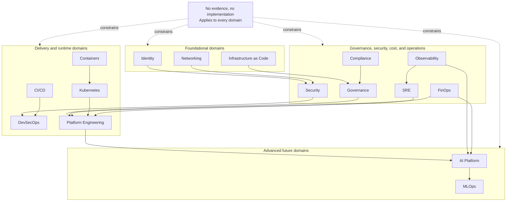

# Platform Domain Map

## Status

Representation type: **Target conceptual state**.

Status: **Designed**.

Label: **Target conceptual architecture — not implementation evidence.**

## Purpose

This diagram answers: how are the documented ECPEL platform domains conceptually organized, and which areas are foundational, delivery/runtime, operational/governance, or advanced capabilities?

## Scope

Included domains are derived from [BLUEPRINT.md](../../BLUEPRINT.md) and [ARCHITECTURE.md](../../ARCHITECTURE.md): Identity, Networking, Security, Compliance, Governance, FinOps, Observability, Infrastructure as Code, CI/CD, Containers, Kubernetes, Platform Engineering, DevSecOps, SRE, AI Platform, and MLOps.

Excluded:

- provider-specific resource topology;
- account IDs, regions, VPCs, CIDR ranges, subnets, clusters, production environments, and customer data;
- any claim that a domain is implemented.

## Source Documents

- [BLUEPRINT.md](../../BLUEPRINT.md)
- [ARCHITECTURE.md](../../ARCHITECTURE.md)
- [ROADMAP.md](../../ROADMAP.md)
- [ADR-0004: Adopt Evidence-Driven Implementation Rule](../adr/0004-adopt-evidence-driven-implementation-rule.md)

## Diagram

## Interpretation

The diagram groups documented domains by conceptual role. Identity, Networking, and Infrastructure as Code are foundational because later platform capabilities depend on access, connectivity, and reproducibility. Security, Compliance, Governance, FinOps, Observability, and SRE are cross-cutting operational concerns. CI/CD, DevSecOps, Containers, Kubernetes, and Platform Engineering represent delivery and runtime organization. AI Platform and MLOps are advanced future domains that build on the cloud platform foundation.

## Limitations

> This diagram represents documented intent or conceptual relationships. It is not evidence of deployed infrastructure.

The diagram does not show accounts, regions, networks, clusters, services, environments, or production systems. It does not imply that any domain is implemented.

## Related Documents

- [Repository Document Relationships](repository-document-relationships.md)
- [Capability Dependency Map](capability-dependency-map.md)
- [Evidence and Status Lifecycle](evidence-and-status-lifecycle.md)
