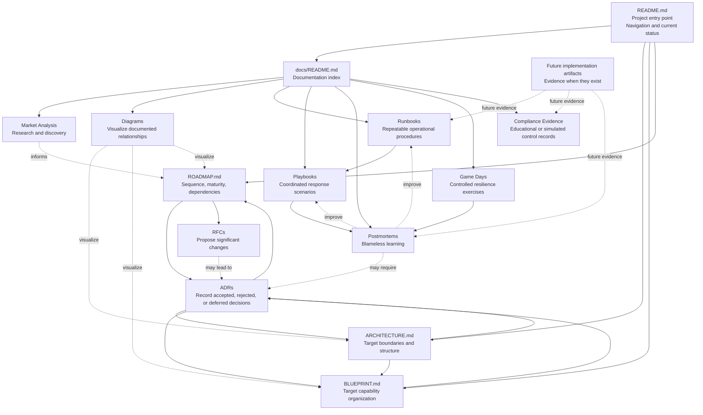

# Repository Document Relationships

## Status

Representation type: **Current repository state**.

Status: **In Progress**.

This diagram maps documentation relationships that currently exist in the repository. It does not claim that implementation artifacts currently exist.

## Purpose

This diagram answers: how do the principal ECPEL documents relate to each other, and where would evidence-backed implementation artifacts fit when they eventually exist?

## Scope

Included:

- project entry points;
- research and discovery documents;
- architectural direction;
- decision records;
- delivery planning;
- operational documentation;
- compliance evidence templates;
- future implementation evidence category.

Excluded:

- deployed infrastructure;
- cloud resource topology;
- production environments;
- real implementation artifacts that are not present in the repository.

## Source Documents

- [README.md](../../README.md)
- [ARCHITECTURE.md](../../ARCHITECTURE.md)
- [BLUEPRINT.md](../../BLUEPRINT.md)
- [ROADMAP.md](../../ROADMAP.md)
- [ADRs](../adr/README.md)
- [RFCs](../rfcs/README.md)
- [Market Analysis](../market-analysis/README.md)
- [Runbooks](../runbooks/README.md)
- [Playbooks](../playbooks/README.md)
- [Postmortems](../postmortems/README.md)
- [Game Days](../game-days/README.md)
- [Compliance](../compliance/README.md)

## Diagram

## Interpretation

README provides the project entry point, navigation, and current status. Market analysis can inform planning, while Architecture and Blueprint describe target direction and capability organization. ROADMAP defines sequencing and dependencies. RFCs propose significant changes, and ADRs record accepted, rejected, superseded, deprecated, or intentionally deferred decisions.

Runbooks, playbooks, postmortems, game days, and compliance evidence are operational and evidence-oriented documentation areas. Future implementation artifacts are shown as a category, not as existing deployed infrastructure.

## Limitations

> This diagram represents documented intent or conceptual relationships. It is not evidence of deployed infrastructure.

The diagram does not prove that implementation artifacts exist. It does not show production systems, cloud resources, network topology, or deployed services.

## Related Documents

- [ECPEL Documentation](../README.md)
- [Architecture Decision Records](../adr/README.md)
- [Operational templates](../runbooks/README.md)
