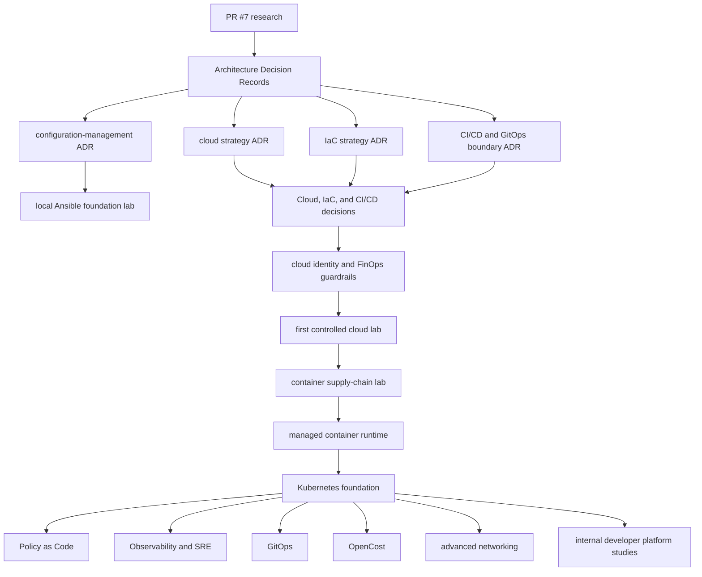

# Roadmap Derived from the 2026 Market Matrix

## Status

Recommendation — requires separate review and evidence per milestone.

This roadmap does not authorize cloud access, expenditure, or deployment.

## Governing Principles

- No evidence, no implementation.
- One branch and one PR per cohesive objective.
- Keep research, ADRs, simulations, and implementations separate.
- Cloud apply requires explicit human approval.
- Paid resources require cost boundaries and verified cleanup.
- Prefer federation instead of long-lived repository credentials.

## Dependency Map

## Milestone 1 — Architecture Decisions

Require separate ADRs for:

- cloud strategy;
- IaC strategy;
- configuration-management strategy;
- CI/CD and GitOps boundaries.

Azure is the leading candidate, not adopted.

The IaC ADR must compare Terraform, OpenTofu, and Pulumi.

Crossplane remains a later decision.

## Milestone 2 — Local Ansible Foundation

Require:

- disposable target;
- inventory;
- playbook;
- roles;
- variables;
- templates;
- handlers;
- lint;
- syntax check;
- check and diff modes;
- idempotence evidence;
- cleanup;
- no cloud credentials;
- no production target.

## Milestone 3 — Cloud Guardrail Design

Require:

- verified ownership;
- billing and eligibility review;
- budget or spending protection;
- tags or labels;
- approved region;
- expected maximum cost;
- GitHub OIDC design;
- restricted trust;
- separate plan and apply;
- protected-environment approval;
- emergency revocation;
- destroy and post-destroy verification.

## Milestone 4 — First Controlled Cloud Lab

Use the approved OIDC-to-destroy sequence.

Explicitly exclude initially:

- Kubernetes;
- NAT gateway or equivalent persistent appliance;
- enterprise transit;
- managed database;
- unrestricted public administration;
- static administrator credentials;
- unattended resources.

## Milestone 5 — Container Supply Chain

Require:

- reproducible build;
- minimal image;
- non-root runtime when applicable;
- dependency scan;
- image scan;
- SBOM;
- digest;
- provenance;
- signing;
- verification;
- cleanup.

## Milestone 6 — Managed Container Runtime

Compare only after the cloud ADR:

- ECS with Fargate;
- Azure Container Apps;
- Cloud Run.

## Milestone 7 — Kubernetes Foundation

Require evidence for identity, network, registry, image security, secrets, budgets, observability, recovery, and destruction first.

## Milestone 8 — Kubernetes Platform Capabilities

Use separate future objectives for:

- OPA or Kyverno;
- OpenTelemetry, Prometheus, and Grafana;
- Argo CD or Flux;
- OpenCost;
- Cilium and eBPF;
- failure testing and runbooks.

## Milestone 9 — Jenkins Enterprise Comparator

Require controller, agents, authentication, plugin baseline, credential handling, network restrictions, resource limits, backup, restore, upgrades, and teardown.

Jenkins is not automatically replacing GitHub Actions.

## Milestone 10 — Platform Engineering

Backstage requires catalog and ownership models.

Crossplane requires stable Kubernetes and IaC decisions.

## Decision Gates

| Gate | Required evidence |
| --- | --- |
| Research to ADR | Approved matrix, official sources, risks, limitations |
| ADR to local lab | Accepted decision, bounded scope, validation plan |
| ADR to cloud lab | Identity, budget, cost estimate, cleanup, approval |
| Container to managed runtime | Scan, SBOM, digest, registry lifecycle |
| Managed runtime to Kubernetes | Identity, network, cost, secrets, observability, recovery |
| Kubernetes to GitOps and platform | Stable lifecycle and operational ownership |

## Implementation Boundary

The roadmap creates no resource, credential, workflow, branch, or deployment.
